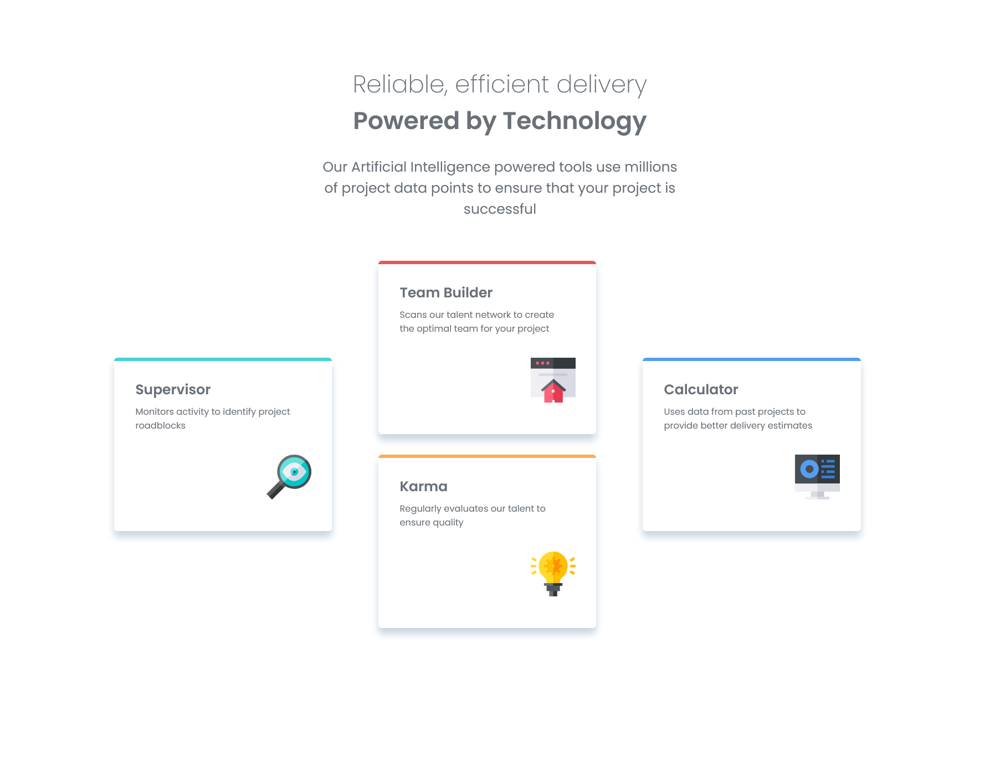

# Frontend Mentor - Four card feature section solution

This is a solution to the [Four card feature section challenge on Frontend Mentor](https://www.frontendmentor.io/challenges/four-card-feature-section-weK1eFYK). Frontend Mentor challenges help you improve your coding skills by building realistic projects. 

## Table of contents

- [Overview](#overview)
  - [Screenshot](#screenshot)
  - [Links](#links)
- [My process](#my-process)
  - [Built with](#built-with)
  - [What I learned](#what-i-learned)
  - [Continued development](#continued-development)
  - [Useful resources](#useful-resources)
- [Author](#author)
- [Acknowledgments](#acknowledgments)

## Overview

### Screenshot




### Links

- Solution URL: [Solution here](https://github.com/MariaCMontO/card-feature-cmo)

## My process

### Built with

- Semantic HTML5 markup
- CSS custom properties
- Flexbox

### What I learned

With this project, I learned how to use grid, and how to make responsive projects ussing clamp, which was so usefull to avoid using media queries.

```css
header {
    text-align: center;
    padding-inline: 1rem;
    margin-bottom: clamp(5rem, 6vw, 6rem);
    max-inline-size: clamp(31.5rem, 90vw, 55rem);
    margin-inline: auto;
}

header h1 {
    font-weight: 200;
    font-size: clamp(2.4rem, 3vw, 3.5rem );
}

header h2 {
    font-weight: 600;
    font-size: clamp(2.4rem, 3vw, 3.5rem );
}
@media (min-width:76.8rem) {

    .card-wrapper {
        display: grid;
        grid-template-columns: 1fr 1fr 1fr;
        grid-template-rows: 1fr 1fr;
        gap: clamp(2rem, 3vw, 3rem);
        align-items: center;
        justify-content: center;
    }
    .supervisor{
        grid-column: 1/2;
        grid-row: 1/3;
    }
    .calculator{
        grid-column: 3/4;
        grid-row: 1/3;
    }

}
```

### Continued development

I definitely want to keep developing interfaces using the rem unit - it makes many task much easier. However, I also want to improve my understanding about paddings and margins to become a more practical and efficient developer. 

### Useful resources

## Author

- Frontend Mentor - [@MariaCMontO](https://github.com/MariaCMontO)


## Acknowledgments